# GitHub Copilot カスタマイズ概要

> 「チャットで指示はできるけど、毎回同じことを書くのが面倒…」→ **カスタマイズで解決できます。**

## カスタマイズの全体像



## 各カスタマイズ手段の比較

| 手段 | 主なファイル | 用途 | 難易度 |
|------|-------------|------|:------:|
| [カスタム指示](./01_custom-instructions.md) | `copilot-instructions.md` / `*.instructions.md` | コーディングルール・規約の常時適用 | ⭐ |
| [プロンプトファイル](./02_prompt-files.md) | `*.prompt.md` | よく使うタスクをスラッシュコマンド化 | ⭐ |
| [カスタムエージェント](./03_custom-agents.md) | `*.agent.md` | 専門的なAIアシスタントを定義 | ⭐⭐ |
| [MCPサーバー](./04_mcp-servers.md) | `mcp.json` | 外部ツール・APIとの連携 | ⭐⭐⭐ |
| [フック](./05_hooks.md) | `.github/copilot-hooks.json` | エージェント動作の自動制御 | ⭐⭐⭐ |

## おすすめの導入順序



## ファイル配置マップ

```
your-project/
├── .github/
│   ├── copilot-instructions.md   ← 常時適用の指示
│   ├── copilot-hooks.json        ← フック設定
│   ├── instructions/
│   │   └── *.instructions.md     ← スコープ付き指示（デフォルト保存先）
│   ├── prompts/
│   │   └── *.prompt.md           ← プロンプトファイル
│   ├── agents/
│   │   └── *.agent.md            ← カスタムエージェント
│   └── skills/
│       └── */SKILL.md            ← エージェントスキル
├── .vscode/
│   └── mcp.json                  ← MCPサーバー設定
└── src/
    └── *.instructions.md         ← スコープ付き指示（任意の場所にも配置可）
```

## 次のステップ

- まずは → [カスタム指示](./01_custom-instructions.md) から始めましょう
- 実践的なワークフロー例 → [Tips & ベストプラクティス](./06_tips.md)
- 公式ドキュメント → [Customize AI in VS Code](https://code.visualstudio.com/docs/copilot/customization/overview)
- 利用可能なツール → [Use tools with agents](https://code.visualstudio.com/docs/copilot/agents/agent-tools)
- ビルトインツール一覧 → [Chat tools（チートシート）](https://code.visualstudio.com/docs/copilot/reference/copilot-vscode-features#_chat-tools)

---

> **免責事項**: 本ドキュメントは VS Code 公式ドキュメント（2025年7月時点）を基に作成した初版です。内容は AI と人間によるレビューを経ていますが、最新情報は公式ドキュメントをご確認ください。
