# カスタム指示（Custom Instructions）

> Copilotに「毎回伝えていたルール」をファイルに書いておくだけで、自動的に適用される仕組み。

## 概要



## 指示ファイルの種類

| ファイル | 場所 | 適用範囲 | 用途 |
|---------|------|---------|------|
| `copilot-instructions.md` | `.github/` | プロジェクト全体・常時 | コーディング規約、技術スタック指定 |
| `.instructions.md` | `.github/instructions/`（デフォルト）または任意 | `applyTo` で制御 | 特定ファイル・ディレクトリの規約 |
| `AGENTS.md` | ルート or 任意 | 常時（全チャットリクエスト） | プロジェクト全体のエージェント指示 |
| `CLAUDE.md` | ルート or 任意 | 常時（全チャットリクエスト） | Claude互換の指示ファイル |

## 1. copilot-instructions.md（まずはこれ）

**場所:** `.github/copilot-instructions.md`

プロジェクト全体に常時適用される指示。チャット・エージェントに適用される（エディタ上のインライン提案には適用されない）。

### 記述例

```markdown
# プロジェクト指示

## 技術スタック
- TypeScript + React 18
- テストは Vitest を使用
- スタイリングは Tailwind CSS

## コーディング規約
- 関数コンポーネントのみ使用（classコンポーネント禁止）
- `any` 型の使用禁止
- エラーハンドリングは必ず Result 型パターンで

## 命名規則
- コンポーネント: PascalCase
- 関数・変数: camelCase
- 定数: UPPER_SNAKE_CASE
- ファイル名: kebab-case.ts
```

## 2. .instructions.md（スコープ付き指示）

**デフォルト保存先:** `.github/instructions/`（任意のディレクトリにも配置可）

`applyTo` メタデータでどのファイルに適用するか制御。

### 記述例

```markdown
---
applyTo: "**/*.test.ts"
---
- テストは AAA パターン（Arrange / Act / Assert）で記述する
- モックには vi.mock() を使う
- テスト名は日本語で記述する
```

### applyTo パターン例

| パターン | 適用対象 |
|---------|---------|
| `**/*.ts` | 全てのTypeScriptファイル |
| `src/api/**` | src/api配下の全ファイル |
| `**/*.test.ts` | 全てのテストファイル |
| `*.md` | ルートのMarkdownファイル |

## 3. AGENTS.md

**場所:** プロジェクトルート or 任意のディレクトリ

VS Codeが自動検出し、**全てのチャットリクエストに常時適用される**。`copilot-instructions.md` と併用可能。

```markdown
# ルール
- コード変更前にテストを必ず実行する
- ファイル削除前に確認を求める
- コミットメッセージは Conventional Commits 形式で
```

## よくあるパターン



## 設定のヒント

- `copilot-instructions.md` は **簡潔に**（長すぎるとノイズになる）
- 技術スタック・主要ライブラリは必ず明記する
- 「やらないこと」も書く（例：`any` 禁止、`class` コンポーネント禁止）
- `.instructions.md` は対象ファイルの近くに配置すると管理しやすい

## 公式ドキュメント

- [Custom instructions](https://code.visualstudio.com/docs/copilot/customization/custom-instructions)

---

> **免責事項**: 本ドキュメントは VS Code 公式ドキュメント（2025年7月時点）を基に作成した初版です。内容は AI と人間によるレビューを経ていますが、最新情報は公式ドキュメントをご確認ください。

---

**← 前へ** [概要](./00_overview.md) | **次へ →** [プロンプトファイル](./02_prompt-files.md)
