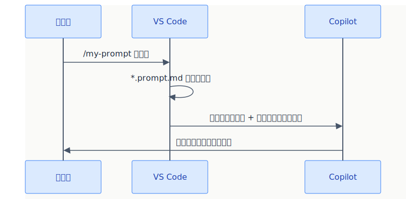

# プロンプトファイル（Prompt Files）

> よく使うチャット指示を `*.prompt.md` に保存 → **スラッシュコマンドとして呼び出せる。**

## 概要



## 基本セットアップ

| 項目 | 内容 |
|------|------|
| **ファイル形式** | `*.prompt.md`（Markdownファイル） |
| **配置場所** | `.github/prompts/` |
| **呼び出し方** | チャットで `/ファイル名` |
| **VS Code設定** | `chat.promptFilesLocations` で場所をカスタマイズ可能 |

## ファイル名の付け方

ファイル名は `{action}.prompt.md` の形式で、タスク内容がわかる名前を付ける。ファイル名（拡張子を除く）がそのままスラッシュコマンド名になる。

| ファイル名 | スラッシュコマンド | 用途 |
|-----------|----------|------|
| `review.prompt.md` | `/review` | コードレビュー |
| `test.prompt.md` | `/test` | テスト生成 |
| `refactor.prompt.md` | `/refactor` | リファクタリング |
| `doc.prompt.md` | `/doc` | ドキュメント生成 |
| `commit.prompt.md` | `/commit` | コミットメッセージ生成 |
| `migrate.prompt.md` | `/migrate` | マイグレーション支援 |

> **ヒント:** フロントマターの `name` フィールドでファイル名とは別のスラッシュコマンド名を指定することも可能。

## 基本的な書き方

**ファイル:** `.github/prompts/review.prompt.md`

```markdown
以下の観点でコードレビューしてください：

1. **バグリスク**: null/undefinedの可能性、境界値
2. **パフォーマンス**: 不要な再レンダリング、N+1クエリ
3. **可読性**: 命名、関数の長さ、ネスト深度
4. **セキュリティ**: XSS、SQLインジェクション、認証漏れ

問題がある場合は修正案も提示してください。
```

→ チャットで `/review` と打つだけで実行

## 変数・ファイル参照の活用

### 変数を使う

```markdown
---
description: "コンポーネントのテストを生成"
---
# テスト生成

対象: ${file}

以下のルールでテストを生成:
- フレームワーク: Vitest + React Testing Library
- カバレッジ: 正常系・異常系・エッジケース
- モック: 外部依存は全てモック化
```

### 使える変数

| 変数 | 内容 |
|------|------|
| `${file}` | 現在開いているファイルのフルパス |
| `${fileBasename}` | ファイル名（拡張子付き） |
| `${fileDirname}` | ファイルのディレクトリパス |
| `${fileBasenameNoExtension}` | ファイル名（拡張子なし） |
| `${selection}` / `${selectedText}` | 現在の選択テキスト |
| `${workspaceFolder}` | ワークスペースフォルダのパス |
| `${workspaceFolderBasename}` | ワークスペースフォルダ名 |
| `${input:variableName}` | 実行時にユーザー入力を求める |
| `${input:variableName:placeholder}` | プレースホルダー付きユーザー入力 |

### ファイル参照

```markdown
# API実装

アーキテクチャは以下を参照:
[](../../docs/ARCHITECTURE.md)

以下のパターンに従ってAPIエンドポイントを実装してください。
```

`[]()` 形式でプロジェクト内のファイルをコンテキストとして添付可能。

## フロントマターのフィールド一覧

| フィールド | 必須 | 説明 |
|-----------|:----:|------|
| `description` | - | スラッシュコマンド一覧で表示される説明文 |
| `name` | - | スラッシュコマンド名（省略時はファイル名） |
| `tools` | - | 使用可能ツールの配列（ツール名の文字列リスト） |
| `agent` | - | プロンプト実行時のエージェント（`ask` / `agent` / `plan` / カスタムエージェント名） |
| `model` | - | 使用する言語モデルの指定 |
| `argument-hint` | - | チャット入力欄に表示されるヒントテキスト |

## ツール設定（使えるツールを制限）

```markdown
---
tools:
  - editFiles
  - runInTerminal
description: "リファクタリング用プロンプト"
---
選択したコードをリファクタリングしてください。
変更後にテストを実行して確認してください。
```

> **注意:** `tools` はツール名の文字列配列です。MCPサーバーの全ツールを含める場合は `<server-name>/*` 形式を使用。

### 利用可能なビルトインツール

チャット入力欄で `#` を入力すると、利用可能な全ツールの一覧を確認できます。主なビルトインツール:

| カテゴリ | 主なツール名 |
|---------|-------------|
| **ファイル操作** | `editFiles`, `createFile`, `readFile`, `listDirectory`, `createDirectory`, `fileSearch`, `textSearch` |
| **ターミナル** | `runInTerminal`, `getTerminalOutput`, `terminalLastCommand` |
| **検索・コンテキスト** | `codebase`, `searchResults`, `usages`, `problems`, `changes` |
| **外部連携** | `fetch`, `githubRepo`, `extensions` |
| **テスト** | `runTests`, `testFailure` |
| **VS Code 操作** | `runVscodeCommand`, `openSimpleBrowser`, `VSCodeAPI` |
| **ツールセット** | `edit`, `search`, `runCommands`, `runNotebooks`, `runTasks` |

ビルトインツール以外にも、[MCPサーバー](./04_mcp-servers.md)や VS Code 拡張機能が提供するツールも使用できます。

> **参照:** 完全なツール一覧は [チートシート - Chat tools](https://code.visualstudio.com/docs/copilot/reference/copilot-vscode-features#_chat-tools) を参照。

## 実用例

| ファイル名 | 用途 | 呼び出し |
|-----------|------|---------|
| `review.prompt.md` | コードレビュー | `/review` |
| `test.prompt.md` | テスト生成 | `/test` |
| `refactor.prompt.md` | リファクタリング | `/refactor` |
| `doc.prompt.md` | ドキュメント生成 | `/doc` |
| `commit.prompt.md` | コミットメッセージ生成 | `/commit` |
| `migrate.prompt.md` | マイグレーション支援 | `/migrate` |

## チャットからの保存（/savePrompt）

チャットで良い指示ができたら、その場で保存できる:

1. チャットで良い結果を得る
2. `/savePrompt` と入力
3. ファイル名をつけて保存 → `.github/prompts/` に `*.prompt.md` として保存される

## 公式ドキュメント

- [Prompt files](https://code.visualstudio.com/docs/copilot/customization/prompt-files)
- [Use tools with agents](https://code.visualstudio.com/docs/copilot/agents/agent-tools) — ツールの種類・承認フロー・ツールセット
- [Chat tools（チートシート）](https://code.visualstudio.com/docs/copilot/reference/copilot-vscode-features#_chat-tools) — ビルトインツール完全一覧

---

> **免責事項**: 本ドキュメントは VS Code 公式ドキュメント（2025年7月時点）を基に作成した初版です。内容は AI と人間によるレビューを経ていますが、最新情報は公式ドキュメントをご確認ください。

---

**← 前へ** [カスタム指示](./01_custom-instructions.md) | **次へ →** [カスタムエージェント](./03_custom-agents.md)
