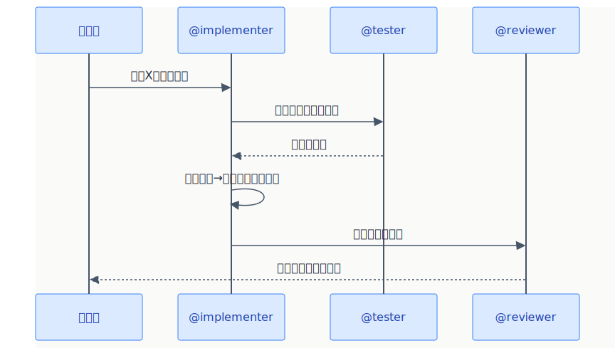

# カスタムエージェント（Custom Agents）

> 特定の役割・ツール・ルールを持った「専門AIアシスタント」を定義できる。

## 概要



## プロンプトファイルとの違い

| | プロンプトファイル `*.prompt.md` | カスタムエージェント `*.agent.md` |
|---|---|---|
| **呼び出し** | `/コマンド名` | Agentsドロップダウンから選択 / `@エージェント名` |
| **性質** | 単発のタスク指示 | 専門的なペルソナ（人格） |
| **ツール制御** | 任意で制限可 | 使えるツールを明示的に指定 |
| **ハンドオフ** | ❌ | ✅ 他のエージェントに委任可能 |
| **会話の継続** | 1回きり | セッション内で継続的に対話 |

## 基本セットアップ

| 項目 | 内容 |
|------|------|
| **ファイル形式** | `*.agent.md`（Markdownファイル） |
| **配置場所** | `.github/agents/` |
| **呼び出し方** | Agentsドロップダウンから選択、またはチャットで `@ファイル名` |
| **VS Code設定** | `chat.agentFilesLocations` で場所をカスタマイズ可能 |

## ファイル名の付け方

ファイル名は `{role}.agent.md` の形式で、エージェントの役割がわかる名前を付ける。ファイル名（拡張子を除く）が Agents ドロップダウンの表示名や `@` メンション名になる。

| ファイル名 | 呼び出し | 用途 |
|-----------|---------|------|
| `reviewer.agent.md` | `@reviewer` | コードレビュー |
| `tester.agent.md` | `@tester` | テスト作成・TDD |
| `planner.agent.md` | `@planner` | 設計・実装計画 |
| `architect.agent.md` | `@architect` | アーキテクチャ判断 |

> **ヒント:** フロントマターの `name` フィールドでファイル名とは別の表示名を指定可能。

## 基本的な書き方

**ファイル:** `.github/agents/reviewer.agent.md`

```markdown
---
tools:
  - editFiles
  - readFile
  - codebase
description: "コードレビュー専門エージェント"
---
```

### フロントマターで使えるフィールド

| フィールド | 必須 | 説明 |
|-----------|:----:|------|
| `tools` | - | 使用可能ツールの配列（ツール名の文字列リスト） |

> **ヒント:** チャット入力欄で `#` を入力すると利用可能な全ツールの一覧を確認できます。ビルトインツールの完全な一覧は [Chat tools（チートシート）](https://code.visualstudio.com/docs/copilot/reference/copilot-vscode-features#_chat-tools) を参照。MCPサーバーの全ツールを含める場合は `<server-name>/*` 形式を使用。
| `description` | - | エージェントの説明文 |
| `name` | - | 表示名（ファイル名と異なる場合） |
| `model` | - | 使用するモデルの指定（文字列または優先順位の配列） |
| `handoffs` | - | ハンドオフ先の配列（下記参照） |
| `agents` | - | サブエージェントの配列（`*` で全エージェント許可） |
| `mcp-servers` | - | 使用するMCPサーバー |
| `argument-hint` | - | 呼び出し時のヒントテキスト |
| `user-invokable` | - | ユーザーが直接呼び出し可能か（デフォルト: `true`） |
| `disable-model-invocation` | - | モデルによる自動呼び出しを無効化（デフォルト: `false`） |
| `target` | - | ターゲットモード（`vscode` / `github-copilot`） |

### 本文の例

```markdown
# あなたの役割
あなたはシニアコードレビュアーです。

# レビュー観点
1. バグリスク（null安全性、境界値、競合状態）
2. パフォーマンス（不要な計算、メモリリーク）
3. 保守性（SOLID原則、DRY、命名）
4. セキュリティ（入力検証、認証・認可）

# 出力形式
- 問題の重大度: 🔴 Critical / 🟡 Warning / 🔵 Info
- 該当コード箇所
- 理由
- 修正案
```

→ Agentsドロップダウンから `reviewer` を選択、またはチャットで `@reviewer このPRをレビューして` と呼び出す

## ハンドオフ（エージェント間の委任）

エージェント同士が連携できる。

```markdown
---
tools:
  - editFiles
  - runInTerminal
description: "TDD実装エージェント"
handoffs:
  - label: テスト作成
    agent: tester
    prompt: 上記の実装に対するテストを作成してください。
  - label: レビュー依頼
    agent: reviewer
    prompt: 上記の実装をレビューしてください。
---

# あなたの役割
あなたはTDD実装エンジニアです。

# ワークフロー
1. テストを先に書く
2. テストが通る最小限のコードを実装
3. リファクタリング
```

> **ハンドオフの仕組み:** チャット応答完了後にハンドオフボタンが表示され、ユーザーが選択するとターゲットエージェントに切り替わる。`send: true` を指定すると自動送信される。



## エージェントスキル（SKILL.md）

エージェントに「スキル」としてまとまった機能を持たせる。

```
.github/skills/
└── deploy/
    ├── SKILL.md          ← スキル定義
    ├── scripts/
    │   └── deploy.sh     ← 実行スクリプト
    └── templates/
        └── config.yaml   ← テンプレート
```

**SKILL.md の例:**

```markdown
---
name: deploy
description: "アプリケーションのデプロイを実行"
---
# デプロイスキル
scripts/deploy.sh を使ってデプロイを実行します。
環境変数 DEPLOY_ENV で対象環境を指定してください。
```

## 実用例

| エージェント | ファイル名 | 用途 |
|-------------|-----------|------|
| `@reviewer` | `reviewer.agent.md` | コードレビュー |
| `@tester` | `tester.agent.md` | テスト作成・TDD |
| `@architect` | `architect.agent.md` | 設計レビュー・アーキテクチャ判断 |
| `@docs` | `docs.agent.md` | ドキュメント生成・更新 |
| `@migrator` | `migrator.agent.md` | ライブラリ移行・アップグレード |
| `@security` | `security.agent.md` | セキュリティ診断 |

## 公式ドキュメント

- [Custom agents](https://code.visualstudio.com/docs/copilot/customization/custom-agents)
- [Agent Skills](https://code.visualstudio.com/docs/copilot/customization/agent-skills)
- [Subagents](https://code.visualstudio.com/docs/copilot/agents/subagents)
- [Use tools with agents](https://code.visualstudio.com/docs/copilot/agents/agent-tools) — ツールの種類・承認フロー・ツールセット
- [Chat tools（チートシート）](https://code.visualstudio.com/docs/copilot/reference/copilot-vscode-features#_chat-tools) — ビルトインツール完全一覧

---

> **免責事項**: 本ドキュメントは VS Code 公式ドキュメント（2025年7月時点）を基に作成した初版です。内容は AI と人間によるレビューを経ていますが、最新情報は公式ドキュメントをご確認ください。

---

**← 前へ** [プロンプトファイル](./02_prompt-files.md) | **次へ →** [MCPサーバー](./04_mcp-servers.md)
