# MCPサーバー（Model Context Protocol）

> 外部ツール・API・データベースなどをCopilotから直接使えるようにする拡張メカニズム。

## 概要



MCPサーバーは **Copilotが使えるツール** を提供する。例：
- DBにクエリを実行する
- Figmaデザインを取得する
- GitHub Issuesを操作する
- Slackにメッセージを送る

## 基本セットアップ

### 1. 設定ファイルを作成

**ファイル:** `.vscode/mcp.json`

```jsonc
{
  "servers": {
    "github": {
      "type": "stdio",
      "command": "npx",
      "args": ["-y", "@modelcontextprotocol/server-github"],
      "env": {
        "GITHUB_TOKEN": "${input:github-token}"
      }
    }
  },
  "inputs": [
    {
      "id": "github-token",
      "type": "promptString",
      "description": "GitHub Personal Access Token",
      "password": true
    }
  ]
}
```

### 2. トランスポートの種類

| タイプ | 用途 | 設定キー |
|--------|------|---------|
| **stdio** | ローカルプロセス（最も一般的） | `"type": "stdio"` |
| **http** | リモートHTTPサーバー | `"type": "http"`, `"url": "..."` |
| **sse** | Server-Sent Events | `"type": "sse"`, `"url": "..."` |

## 実用例

### ファイルシステムサーバー

```jsonc
{
  "servers": {
    "filesystem": {
      "type": "stdio",
      "command": "npx",
      "args": [
        "-y", "@modelcontextprotocol/server-filesystem",
        "${workspaceFolder}/data"
      ]
    }
  }
}
```

### Docker内で実行

```jsonc
{
  "servers": {
    "my-server": {
      "type": "stdio",
      "command": "docker",
      "args": ["run", "-i", "--rm", "my-mcp-server:latest"]
    }
  }
}
```

## MCPサーバーが提供できるもの



| 提供物 | 説明 | 例 |
|--------|------|-----|
| **ツール** | Copilotが呼び出すアクション | DBクエリ実行、API呼び出し |
| **リソース** | 読み取り専用のデータ | 設定ファイル、スキーマ情報 |
| **プロンプト** | チャットのスラッシュコマンド | `/deploy`, `/analyze` |

## 既存のMCPサーバー

すぐに使える公開MCPサーバー:

| サーバー | 用途 |
|---------|------|
| `@modelcontextprotocol/server-github` | GitHub操作 |
| `@modelcontextprotocol/server-filesystem` | ファイルシステム |
| `@modelcontextprotocol/server-postgres` | PostgreSQL |
| `@modelcontextprotocol/server-sqlite` | SQLite |
| `@modelcontextprotocol/server-brave-search` | Web検索 |

→ 一覧: [MCP Servers リポジトリ](https://github.com/modelcontextprotocol/servers)

## ツール承認

MCPツールは実行前に **ユーザー承認** が必要（デフォルト）。

自動承認の設定（信頼できるサーバーのみ）:

```jsonc
// settings.json
{
  "chat.tools.global.autoApprove": true
}
```

> 個別制御: `chat.tools.terminal.autoApprove`（ターミナル）、`chat.tools.urls.autoApprove`（URL取得）、`chat.tools.edits.autoApprove`（ファイル編集）も設定可能。

## 公式ドキュメント

- [MCP servers](https://code.visualstudio.com/docs/copilot/customization/mcp-servers)
- [MCP developer guide](https://code.visualstudio.com/docs/copilot/guides/mcp-developer-guide)

---

> **免責事項**: 本ドキュメントは VS Code 公式ドキュメント（2025年7月時点）を基に作成した初版です。内容は AI と人間によるレビューを経ていますが、最新情報は公式ドキュメントをご確認ください。

---

**← 前へ** [カスタムエージェント](./03_custom-agents.md) | **次へ →** [フック](./05_hooks.md)
