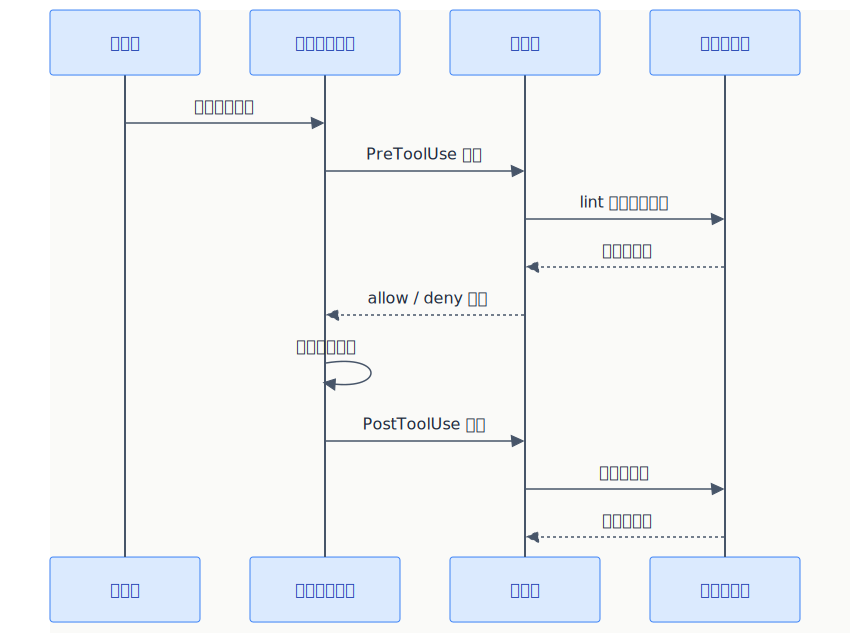

# エージェントフック（Agent Hooks）

> エージェントの動作タイミングに応じて **自動でコマンドを実行** する仕組み。（Preview機能）

## 概要



## フックイベント一覧

| イベント | タイミング | 用途例 |
|---------|-----------|--------|
| `SessionStart` | セッション開始時 | 環境チェック、依存関係確認 |
| `UserPromptSubmit` | ユーザー送信時 | 入力バリデーション |
| `PreToolUse` | ツール実行前 | 危険な操作のブロック |
| `PostToolUse` | ツール実行後 | lint/テスト自動実行 |
| `PreCompact` | コンテキスト圧縮前 | 重要情報の保存 |
| `SubagentStart` | サブエージェント開始時 | ログ記録 |
| `SubagentStop` | サブエージェント終了時 | 結果検証 |
| `Stop` | セッション終了時 | クリーンアップ |

## 基本セットアップ

**ファイル:** `.github/copilot-hooks.json`

イベント名をキーとし、フックエントリの配列を値とするJSON構造:

```json
{
  "hooks": {
    "PostToolUse": [
      {
        "type": "command",
        "command": "npm run lint -- --fix",
        "timeout": 30
      }
    ]
  }
}
```

→ ツール使用後に自動でlintが実行される

## 設定の構造

```json
{
  "hooks": {
    "イベント名": [
      {
        "type": "command",
        "command": "実行するシェルコマンド",
        "timeout": 30,
        "cwd": "作業ディレクトリ（省略可）"
      }
    ]
  }
}
```

| フィールド | 必須 | 説明 |
|-----------|:----:|------|
| `type` | ✅ | `"command"` 固定 |
| `command` | ✅ | 実行するシェルコマンド |
| `timeout` | - | タイムアウト秒数 |
| `cwd` | - | 作業ディレクトリ |
| `env` | - | 環境変数のオブジェクト |
| `windows` / `linux` / `osx` | - | OS別のコマンド上書き |

### 実行許可の制御（PreToolUse）

`PreToolUse` フックでは、コマンドの **stdout に JSON を出力** することでツール実行を制御できる:

```json
{ "permissionDecision": "deny" }
```

| 値 | 動作 |
|-----|------|
| `"allow"` | ツール実行を許可 |
| `"deny"` | ツール実行を拒否 |
| `"ask"` | ユーザーに確認を求める |

## 実用例

### ファイル編集後にテスト実行

```json
{
  "hooks": {
    "PostToolUse": [
      {
        "type": "command",
        "command": "npm test -- --bail",
        "timeout": 60
      }
    ]
  }
}
```

### 危険なコマンドをブロック（PreToolUse）

```json
{
  "hooks": {
    "PreToolUse": [
      {
        "type": "command",
        "command": "./scripts/validate-tool.sh",
        "timeout": 10
      }
    ]
  }
}
```

`validate-tool.sh` の例（危険なコマンドを検出したら deny を出力）:

```bash
#!/bin/bash
# 引数にツール情報が渡される（--tool-name など）
if echo "$@" | grep -qE 'rm -rf|DROP TABLE'; then
  echo '{"permissionDecision": "deny"}'
else
  echo '{"permissionDecision": "allow"}'
fi
```

### セッション開始時に環境チェック

```json
{
  "hooks": {
    "SessionStart": [
      {
        "type": "command",
        "command": "node --version && npm --version && npm test -- --passWithNoTests",
        "timeout": 30
      }
    ]
  }
}
```

## 対話的セットアップ

チャットで `/hooks` コマンドを使うと、対話形式でフックを作成できる。

```
/hooks ファイル編集後にlintとテストを自動実行するフックを作って
```

## 公式ドキュメント

- [Agent hooks (Preview)](https://code.visualstudio.com/docs/copilot/customization/hooks)
- [Security](https://code.visualstudio.com/docs/copilot/security)

---

> **免責事項**: 本ドキュメントは VS Code 公式ドキュメント（2025年7月時点）を基に作成した初版です。内容は AI と人間によるレビューを経ていますが、最新情報は公式ドキュメントをご確認ください。

---

**← 前へ** [MCPサーバー](./04_mcp-servers.md) | **次へ →** [Tips & ベストプラクティス](./06_tips.md)
